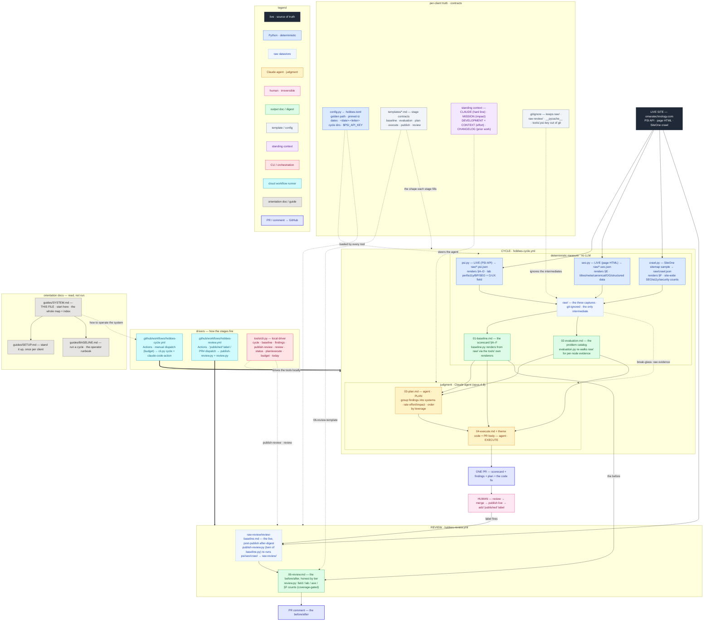

# Hobbes — system map

**Start here.** This is the map of the whole system.

Hobbes is a **web-baseline + agentic-fix system**: it measures a live site, catalogs what's wrong, plans the highest-leverage fixes, writes them as a pull request, and — once a human publishes — re-measures to prove the impact. It runs in GitHub Actions on a Claude Code subscription, and it **writes only to GitHub** (branches, PRs, comments). Every deploy action — preview, publish, go-live — stays human.

| Read | When |
|---|---|
| **This file** | The map — the pipeline, the dataflow, every file's role, the design calls. |
| [`SETUP.md`](SETUP.md) | Stand it up — per-client config + local and cloud wiring. Once per client. |
| [`BASELINE.md`](BASELINE.md) | Run a cycle — the tools, the run, the targets, the deliverables. Every cycle. |
| [`../../CLAUDE.md`](../../CLAUDE.md) | Who Hobbes is — identity, stance, the hard line. Identical across clients. |

**Standing context** (per-client, read on demand): [`MISSION.md`](../MISSION.md) · [`DEVELOPMENT.md`](../DEVELOPMENT.md) · [`CONTEXT.md`](../CONTEXT.md) · [`CHANGELOG.md`](../CHANGELOG.md). Config lives in [`hobbes.toml`](../hobbes.toml).

---

## The pipeline

Six stages, split across a hard **determinism boundary**. Deterministic tools measure and compare. A Claude agent does the judgment — plan and fix. A human owns going live.

```
   ON-DEMAND — one trigger fires measure + fix together, into ONE PR
   (Actions → "Hobbes cycle"; or `python3 hobbes/tools/cli.py cycle` locally for the data alone)
   ┌────────────────────────────────────────────────────────────────┐
   │  DETERMINISTIC (Python, no LLM)   │   JUDGMENT (Claude agent)    │
   │  baseline ─► findings             │   plan ─► execute            │
   └────────────────────────────────────────────────────────────────┘
                       │ ONE PR: scorecard + findings + the code fix
                       ▼ you review + merge
   HUMAN
   ┌─────────────────────────────────────────────┐
   │  publish (go-live)  +  `published`           │   ← you, on your platform, then a PR label
   └─────────────────────────────────────────────┘
                       │ label fires
                       ▼
   DETERMINISTIC
   ┌──────────────────────────────────────────────────────────────┐
   │  review = publish-review (live → raw-review/) ──► review.py   │   ← review workflow (on the label)
   │           diff vs pre-publish 01-baseline ──► PR comment      │
   └──────────────────────────────────────────────────────────────┘
```

| Stage | Kind | Produces | Runs in |
|---|---|---|---|
| **baseline** | tool | `01-baseline.md` (+ raw/) — the scorecard | cycle workflow |
| **findings** | tool | `02-evaluation.md` — the problem catalog | cycle workflow |
| **plan** | agent | `03-plan.md` — systems grouped, rated, ordered by leverage | cycle workflow |
| **execute** | agent | `04-execute.md` + code changes | cycle workflow |
| **publish** | human | the change live on the site | you, on your platform |
| **review** | tools (`publish-review.py` → `review.py`) | a **before/after comment** on the PR | review workflow (on `published`) |

> The first four stages (baseline, findings, plan, execute) run in **one** `Hobbes cycle` workflow and land in **one PR** — the scorecard/findings (data) beside the code fix. The determinism boundary still holds inside that run. The Python tools measure first — reproducibly, no LLM — then the agent judges and fixes. **There is no diff in a cycle.** A cycle measures the current site and has no "after" to compare — this cycle's fix isn't live yet. The before/after is the **review** stage's job, after a publish.

**Why the boundary matters:** measurement must be reproducible — same raw, same findings, IDs and all — so it's deterministic and rebuilt every cycle. Fixing is judgment — what to group, what it costs, what it's worth, what the root cause is — so it's the agent's. Going live is irreversible and outward-facing, so it's the human's.

---

## Follow the data — what reads what, and who emits the content

The stage table above says *what each stage produces*. This is the other axis — the one that's easy to lose: **what each file reads, what it writes, and who consumes that next.** Follow one cycle's data from the live site all the way to the PR comment. Around the dataflow sit the **drivers** that fire each phase (the two workflows + the CLI), the per-client **config and contracts** that feed the stages, and the **orientation docs** — so **every file in the repo appears on this map.**



**What the diagram doesn't show — the five load-bearing handoffs:**

1. **One source, two readers, no middle file.** Each capture tool writes raw JSON to `raw/` (git-ignored). `baseline.py` renders §A–F from `raw/` by calling each tool's *own* `scorecard_section(s)()`; `evaluation.py` re-walks the same `raw/` for node-level evidence. Nothing scrapes stdout. So `02-evaluation.md` can't rebuild from `01-baseline.md` — the catalog needs node detail the scorecard threw away.
2. **Catalog and scorecard share definitions.** Where a number depends on "what counts" — a failing axe audit, a missing OG tag, a flagged crawl row — `evaluation.py` imports the same predicate the scorecard uses (`a11y_audit_failed`, `OG_REQUIRED`, the crawl extractors). Separate scripts, one definition, both read only `raw/`. They can't disagree.
3. **The review runs only post-publish, never in a cycle.** A cycle has no "after" — its fix isn't live yet. So `publish-review.py` (a twin of `baseline.py` over the `capture.py` core) re-captures the live site into `raw-review/`, and `review.py` diffs the **structured JSON sidecars** — `01-baseline.metrics.json` vs `review-baseline.metrics.json`, the same numbers the scorecard renders — tier by tier. A cosmetic table change can't break the diff. This delay is also what lets the 28-day CrUX field signal move.
4. **The agent reads the catalog, not `raw/`.** Judgment works off `02-evaluation.md` — a fixed, deterministic problem list — not megabytes of Lighthouse JSON. `raw/` is **break-glass**: dropped to only when the catalog can't group, cost, or author a fix, because routing judgment through raw re-derives findings non-deterministically.
5. **Authorship is the boundary.** Every number and comparison is Python (`baseline`/`evaluation`/`publish-review`/`review`) — reproducible, unspinnable. The PR comment (`06-review.md`) is 100% Python. Only the fix and the PR body are the agent's, and both ride a fixed template.

### Reads → writes → consumed by

| File | Reads | Writes | Consumed by |
|---|---|---|---|
| `psi.py` | live site (PSI API) | `raw/*.psi.json` (standalone: §A–D digest) | `baseline.py` & `evaluation.py` (both read `raw/`) |
| `seo.py` | live site (HTML) | `raw/*.seo.json` (standalone: §E digest) | `baseline.py` & `evaluation.py` (both read `raw/`) |
| `crawl.py` | live site (sitemap crawl) | `raw/crawl.json` (+ parsed `_detail`) + `raw/crawl-report.html` (standalone: §F digest) | `baseline.py` & `evaluation.py` (both read `raw/`) |
| `capture.py` | — (the shared core: drives psi/seo/crawl, renders §A–F, collects metrics) | — (imported by `baseline.py` & `publish-review.py`) | `baseline.py`, `publish-review.py` |
| `baseline.py` | `raw/` (via `capture.py`) + `01-baseline-template.md` | `01-baseline.md` (the digest) **+ `01-baseline.metrics.json`** (the before-metrics, committed) | the agent, the human, `review.py` (the before, review only) |
| `evaluation.py` | `raw/*.psi.json`, `raw/*.seo.json`, `raw/crawl.json` | `02-evaluation.md` | the agent (plan + execute) |
| `publish-review.py` | live site (psi/seo/crawl, via `capture.py`) → `raw-review/` | `raw-review/review-baseline.md` (after-digest) **+ `review-baseline.metrics.json`** (after-metrics) | `review.py` (the after) — **review phase only** |
| `review.py` | `01-baseline.metrics.json` (before) + `raw-review/review-baseline.metrics.json` (after) + `06-review-template.md` | `06-review.md` | the **post-publish PR comment** — **review phase only, not a cycle** |
| agent · `PLAN` | `02-evaluation.md`, `01-baseline.md`, `MISSION.md` (impact), `DEVELOPMENT.md` + `CONTEXT.md` (effort) · `raw/` break-glass | `03-plan.md` | the execute stage |
| agent · `EXECUTE` | `03-plan.md` (primary), `02-evaluation.md`, `01-baseline.md`, `MISSION.md`, `DEVELOPMENT.md`, `CONTEXT.md`, source · `raw/` break-glass | `04-execute.md`, code, **PR body** | the human (review → publish) |

---

## Every file in the system

### Standing context — who Hobbes is and what it's steering by
*(Read by the agent. Prose, not code.)*

| File | Role |
|---|---|
| [`../CLAUDE.md`](../../CLAUDE.md) | Hobbes's identity, stance, and **the hard line** (never publish/merge/spend without sign-off). Identical across all clients. |
| [`MISSION.md`](../MISSION.md) | What this client optimizes for, as **baseline → target** priorities (e.g. a11y, SEO, performance). Points at the scorecard for the numbers. |
| [`DEVELOPMENT.md`](../DEVELOPMENT.md) | The stack and the build rules — the "done means" gates. |
| [`CONTEXT.md`](../CONTEXT.md) | The client — goals, users, who signs off, where access lives. |
| [`CHANGELOG.md`](../CHANGELOG.md) | What has shipped, why, and to what result. |

### Config — the one source of per-client truth
| File | Lines | Role |
|---|---|---|
| [`hobbes.toml`](../hobbes.toml) | 29 | Per-client config: the golden path (`[[golden_path]]` label + URL entries), branch prefix, **timezone** (pins cycle dates), **effort_budget**, **sample_path** (the crawler's high-volume page type). |

### The deterministic engine — `hobbes/tools/`
| File | Lines | Role |
|---|---|---|
| [`tools/config.py`](../tools/config.py) | — | Single source loaded from `hobbes.toml`: `golden_path()`, `client_meta()`, `psi_key()` ($PSI_API_KEY), `effort_budget()`, `sample_path()`, `today()`/`stamp()` (pinned-tz dates so local + CI never disagree), and the cycle-folder helpers `new_cycle_dir()` / `latest_cycle()` / `cycle_dirs()` / `default_run_dir()` (the `<date>-<letter>` naming, one source so local + CI agree). |
| [`tools/psi.py`](../tools/psi.py) | 403 | PageSpeed Insights / Lighthouse capture → `raw/*.psi.json`. Renders scorecard **§A–D** (lab perf/a11y/BP/SEO + CrUX field) from raw/ (`scorecard_sections`). Median-of-3, retry-resilient — survives PSI timeouts and truncated reads. |
| [`tools/seo.py`](../tools/seo.py) | 372 | Per-page HTML SEO checklist → `raw/*.seo.json`. Renders **§E** from raw/ (`scorecard_section`) — titles, meta, canonical, OG, structured data. |
| [`tools/crawl.py`](../tools/crawl.py) | — | SiteOne sitemap crawl (stratified sample) → `raw/crawl.json` + `raw/crawl-report.html`. Renders **§F** from raw/ (`scorecard_section`) — site-wide SEO/a11y/security counts. The JSON drops all per-analysis detail, so crawl.py also emits the HTML report and parses it (`parse_html_report` → `_detail`) — the only place SiteOne writes the offending element, its occurrence count, and the affected URLs. |
| [`tools/capture.py`](../tools/capture.py) | — | The **shared capture→render→metrics core** for `baseline.py` and `publish-review.py`. It drives psi/seo/crawl `capture()` into a raw dir, renders §A–F via the tools' own renderers, collects the structured `metrics()`, and stamps the shared digest header. The two entry points differ only in target dir, header/intro, and §G — so they can't drift. |
| [`tools/baseline.py`](../tools/baseline.py) | — | The pre-publish entry point. Via `capture.py`, captures into `raw/` of one dated cycle folder (`<date>-<letter>`) and renders §A–F into the digest `01-baseline.md` (from `01-baseline-template.md`), **plus the committed before-metrics `01-baseline.metrics.json`** the review diffs. Honors `--run-dir`. |
| [`tools/evaluation.py`](../tools/evaluation.py) | 1009 | The **problem catalog**. Reads raw/ → `02-evaluation.md`, every issue with verbatim evidence + a static knowledge overlay (what it is, why it matters). Deterministic — fix/effort/impact are left to the plan. |
| [`tools/publish-review.py`](../tools/publish-review.py) | — | **REVIEW-ONLY**, a twin of `baseline.py` over the same `capture.py` core. Captures the **live** site into the cycle's `raw-review/` (beside the pre-publish `raw/`), renders the after-digest `raw-review/review-baseline.md`, **and writes the after-metrics `review-baseline.metrics.json`**. Honors `--run-dir` and defaults to the latest cycle. |
| [`tools/review.py`](../tools/review.py) | — | **REVIEW-ONLY** before/after (not run in a cycle), **honest by tier**: Field (CrUX, trustworthy) / Lab (§A, volatile) / **§D axe a11y** / §F counts (coverage-gated). **Diffs the structured metrics sidecars** — `01-baseline.metrics.json` (before) vs `raw-review/review-baseline.metrics.json` (after) — through `06-review-template.md` → `06-review.md`. No markdown re-parsing — the numbers are `psi.metrics()`/`crawl.metrics()`, the same the scorecard renders. |

### The CLI
| File | Lines | Role |
|---|---|---|
| [`tools/cli.py`](../tools/cli.py) | — | `cycle` (baseline→findings), the individual steps, `publish-review` + `review` (the post-publish before/after), `status`, `plan`/`execute` (print the stage prompt), `budget`, `today`. Run as `python3 hobbes/tools/cli.py <cmd>`. |

### Stage contracts — `hobbes/templates/*.md`
| File | Role |
|---|---|
| [`templates/01-baseline-template.md`](../templates/01-baseline-template.md) | The baseline scorecard shape — §A–G (A–F tool-filled, G manual a11y for the human). |
| [`templates/02-evaluation-template.md`](../templates/02-evaluation-template.md) | The findings contract — dense, evidence-based, deterministic. |
| [`templates/03-plan-template.md`](../templates/03-plan-template.md) | The plan contract — group findings into systems → estimate effort → estimate impact → **order by leverage (impact ÷ effort)**. |
| [`templates/04-execute-template.md`](../templates/04-execute-template.md) | The execute contract — select a batch by effort budget, research, implement the **whole** batch, gates ("no *new* checker offenses"), and the PR's before/after. Never publishes. |
| [`templates/05-publish-template.md`](../templates/05-publish-template.md) | The publish contract — human-owned: PR review → sign-off → merge → go-live → `published` label → review. |
| [`templates/06-review-template.md`](../templates/06-review-template.md) | The review contract — the post-publish before/after shape: the latency caveat + the four honest-by-tier sections (field / lab / axe / counts). `review.py` fills in the computed tables. |

### The cloud runner — `.github/workflows/`
| File | Trigger | Role |
|---|---|---|
| [`../.github/workflows/hobbes-cycle.yml`](../../.github/workflows/hobbes-cycle.yml) | dispatch (budget input) | The work cycle: `cli.py cycle` measures (deterministic, no LLM), then `claude-code-action` plans + writes the fix → **one PR** carrying the scorecard/findings *and* the code. (No diff — that's the review.) |
| [`../.github/workflows/hobbes-review.yml`](../../.github/workflows/hobbes-review.yml) | `published` label + dispatch (PR #) | Post-publish: `publish-review.py` re-captures the **live** site into the PR cycle's `raw-review/`, `review.py` diffs vs the pre-publish `01-baseline.md` → `06-review.md`, commented on the PR. No Claude. |

### Operator guides — `hobbes/guides/`
*(Engine-generic — same across clients. Read by the agent and the human operator.)*
| File | Role |
|---|---|
| [`guides/SYSTEM.md`](SYSTEM.md) | **This file** — the map of the whole system: the pipeline, the data flow, every file's role, and the load-bearing design decisions. |
| [`guides/SETUP.md`](SETUP.md) | **Setup, once per client** — local (Python + SiteOne + PSI key + first cycle) and cloud (two secrets, the Claude GitHub App, the "allow Actions to create PRs" toggle, the `published` label, workflows-on-default-branch), each annotated with the error it prevents. |
| [`guides/BASELINE.md`](BASELINE.md) | The operator's runbook for a baseline cycle — the tools, the run, the targets, the deliverables. Read by the agent during a cycle. |

### Cycle data — `hobbes/cycle/<YYYY-MM-DD>-<letter>/`
Each cycle is a folder — the **filesystem is the state machine**. The folder name is the cycle date plus a letter (`2026-06-26-A`, `-B`, …), assigned upstream so more than one cycle can run on the same day. A folder accumulates, in order: `01-baseline.md` (+ its committed sidecar `01-baseline.metrics.json`) → `02-evaluation.md` → `03-plan.md` → `04-execute.md` (the cycle, beside `raw/`), then post-publish `raw-review/` → `06-review.md` (the review). `raw/` and `raw-review/` hold the `*.psi.json` / `*.seo.json` / `crawl.json` captures — git-ignored, the only build intermediates. The three capture tools write their raw JSON to `raw/` (cycle) or `raw-review/` (review). Then `baseline.py` and `publish-review.py` (over the shared `capture.py` core) render §A–F from those via each tool's own renderer **and emit a `*.metrics.json` sidecar of the structured numbers the review diffs**. The before-metrics is committed beside `01-baseline.md` so a fresh CI review job still has it. The after-metrics rides in the git-ignored `raw-review/`, written and consumed in the same review job. So the before (`01-baseline.md`) and after (`raw-review/review-baseline.md`) of a fix live in **one** cycle folder. Which files exist tells you which stage the cycle reached (`cli.py status`).

---

## How it runs

**Cloud (the default).** Both workflows run from the **default branch** in GitHub Actions:
- **Measure + fix:** Actions → *Hobbes cycle* → Run (blank budget = `hobbes.toml` default). It measures, then plans and writes the fix → **one PR** with the scorecard/findings *and* the code change. Manual trigger only. There is no cron — a cycle fires when you ask for one.
- **Verify:** add the **`published`** label to the merged PR (after you publish/go live). → before/after comment. Manual re-run: Actions → *Hobbes review* → Run → enter the PR number.

GitHub emails you when a PR opens or a comment posts. That's the notification. You don't watch anything.

**Local.** The deterministic half runs on a laptop with Python 3.11+ and the SiteOne crawler — `python3 hobbes/tools/cli.py cycle` produces the data (scorecard + findings) only. The agent half (plan + fix) runs as the cloud workflow, or as local Claude Code against the templates. No secret needed — it uses your login.

**The operator's loop:** run *Hobbes cycle* when you want work → one PR (data + fix) in your inbox · review + merge → publish (go live) → add `published` → the review posts the impact.

---

## Load-bearing design decisions

- **GitHub-only.** Hobbes touches nothing but GitHub. No platform CLI, no deploy credentials. Going live is always a human on the platform.
- **Claude Code, not the API.** The agent stage (plan + fix) authenticates with a **Claude Code subscription token** (`claude setup-token` → `CLAUDE_CODE_OAUTH_TOKEN`), never a pay-per-token API key. The deterministic stages use no Claude at all.
- **The determinism boundary.** Tools measure and compare, reproducibly. The agent judges and builds, creatively. The human publishes, irreversibly. Each thing lives where it belongs.
- **Measure and fix fire together, into one PR.** A CI cycle always runs the deterministic measure *and* the agent fix on one trigger, landing the scorecard/findings beside the code change in a single PR. So the fix is always planned against fresh measurements, never a stale cycle folder. There's no measure-only cron — a data-only run is the local `cli.py cycle`.
- **The before/after is the review's, not the cycle's.** A cycle measures the current site and has no "after" — this cycle's fix isn't live yet — so it writes no review. The before/after lives entirely in the **review** phase, post-publish. `publish-review.py` re-captures the live site into the cycle's `raw-review/`, and `review.py` compares it to the same cycle's pre-publish `01-baseline.md` (the before — everything leading up to the PR). This also gives the 28-day CrUX field signal time to move, which an at-publish comparison can't.
- **The review doesn't lie.** When it runs (post-publish), `review.py` separates the trustworthy field signal from volatile lab noise, gates site-wide counts on crawl coverage (a collapsed crawl can't read as "improvement"), and surfaces the §D a11y findings the agent actually targets — telling a real win from noise from an *unfulfilled claim*.
- **`published` is an explicit signal.** The review fires on a human-added label, not on merge — because "merged" doesn't mean "live," and every client's hosting/deploy is wired differently.
- **Pinned-timezone dates.** Cycle folders are stamped in `[cycle].timezone`, so a local run and a UTC CI runner always land on the same calendar day.
- **Effort budget is a ceiling, not a quota.** Execute fills it with leverage-ordered work and won't shoehorn. A high budget only produces a big PR when there's that much worthwhile work queued.
